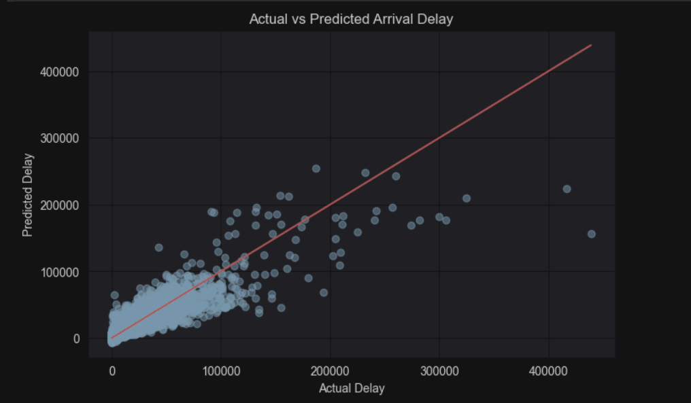

# ✈️ Airline Delay Prediction using Machine Learning & Power BI

## 📌 Project Overview

This project analyzes historical airline operational data to identify flight delay patterns and predict arrival delays using Machine Learning. It combines SQL, Python, Power BI, and Linear Regression to generate business insights and build a predictive model.

---

## 🎯 Objectives

- Analyze airline delay trends.
- Identify the major causes of flight delays.
- Build a Machine Learning model to predict arrival delays.
- Create an interactive Power BI dashboard for business insights.

---

## 🛠️ Technologies Used

- Python
- Pandas
- NumPy
- Matplotlib
- Scikit-learn
- SQL (MySQL)
- Power BI
- Jupyter Notebook

---

## 📂 Project Structure

```
Airline-Delay-Prediction-ML/
│
├── data/
│   └── Airline_Delay_Cleaned.csv
│
├── notebook/
│   └── Airline_Delay_Prediction.ipynb
│
├── dashboard/
│   ├── Airline_Dashboard.pbix
│   └── dashboard.png
│
├── model/
│   └── arrival_delay_model.pkl
│
├── sql/
│   └── airline_queries.sql
│
├── images/
│   └── actual_vs_predicted.png
│
├── README.md
├── requirements.txt
└── .gitignore
```

---

## 📊 Machine Learning Workflow

- Data Collection
- Data Cleaning
- Exploratory Data Analysis (EDA)
- Feature Engineering
- Train-Test Split (80:20)
- Linear Regression Model
- Model Evaluation
- Prediction

---

## 📈 Model Performance

| Metric | Value |
|---------|-------|
| MAE | 1931.49 |
| MSE | 29487106.47 |
| RMSE | 5430.20 |
| R² Score | 0.82 |

---

## 📊 Power BI Dashboard

> Add your dashboard screenshot below.


---

## 🤖 Machine Learning Prediction

> Actual vs Predicted Arrival Delay



---

## 🔍 Business Questions

- Which airline has the highest arrival delay?
- Which airport experiences the highest delays?
- Which month has the highest average arrival delay?
- What are the major reasons for flight delays?
- Which airline has the highest number of cancelled flights?
- Which airline has the highest number of diverted flights?

---

## 💡 Key Insights

- Flight delays vary significantly across airports and airlines.
- Airport location has a strong influence on arrival delays.
- The Linear Regression model explains approximately **82%** of the variation in arrival delays.
- The Power BI dashboard enables interactive analysis by airline and month.

---

## 🚀 Future Improvements

- Compare Linear Regression with Random Forest and XGBoost.
- Deploy the model using Flask or Streamlit.
- Add real-time flight data for live predictions.

---

## 👤 Author

**Nitin Kumar**
